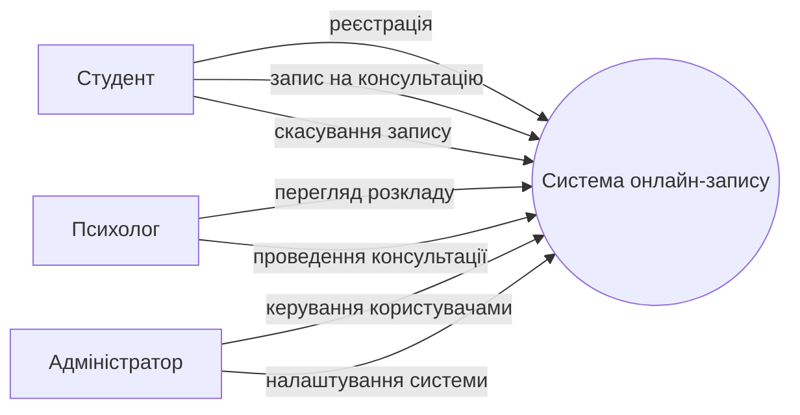
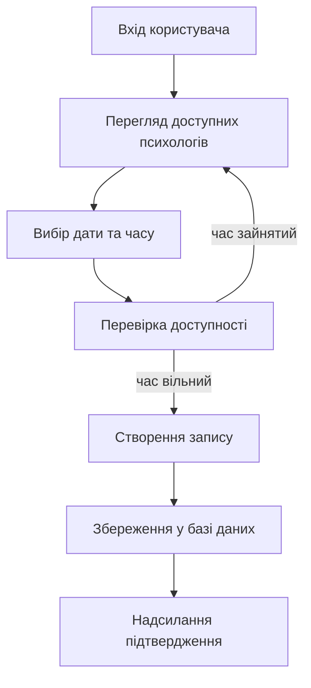
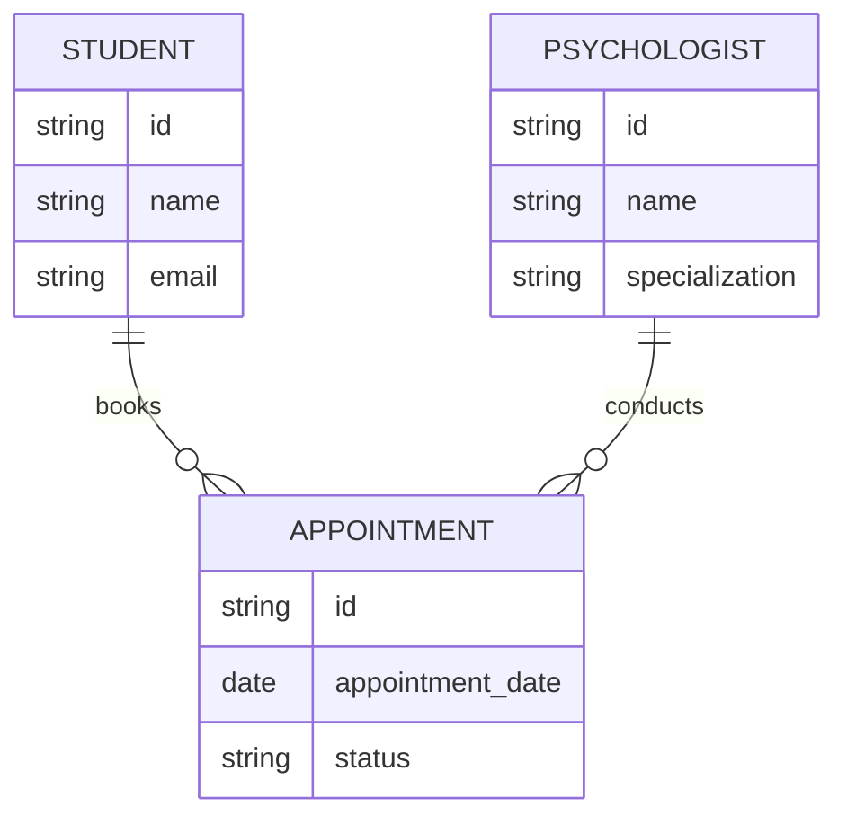
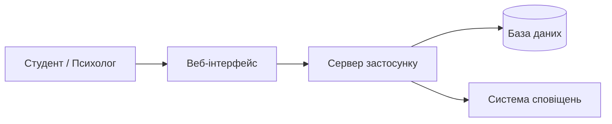
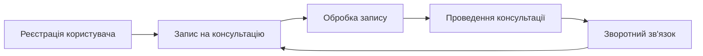
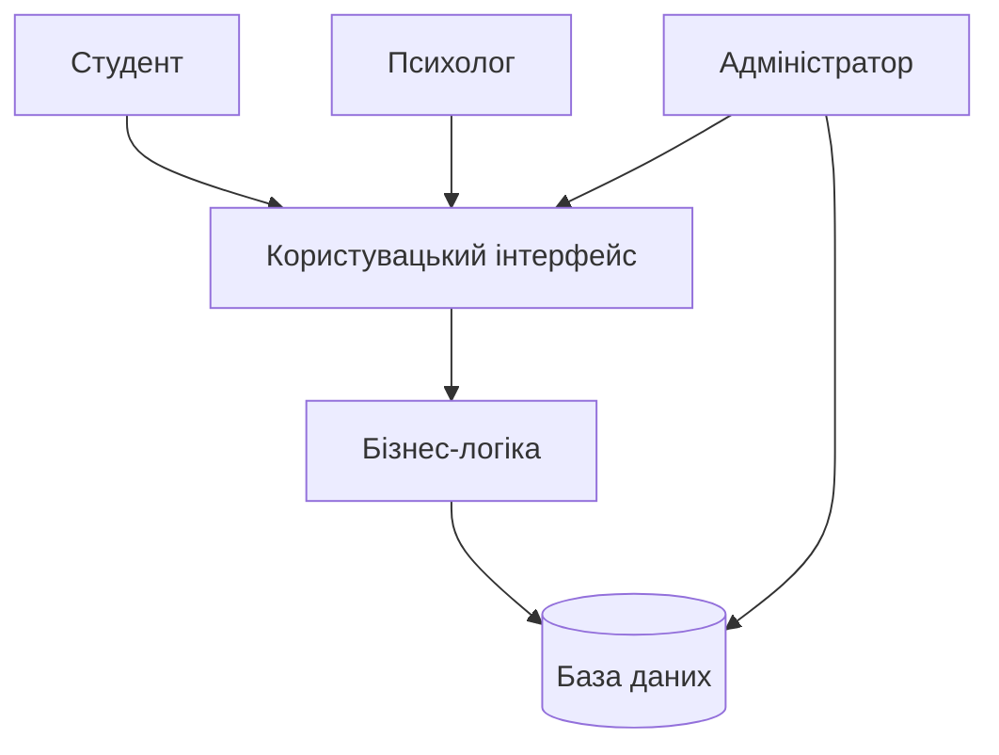

## Use Case діаграма (взаємодія користувачів із системою)

## Діаграма процесу запису (Flowchart)

## ER-діаграма бази даних

## Архітектурна діаграма системи

## Діаграма циклів системи

## Діаграма точок впливу на систему
