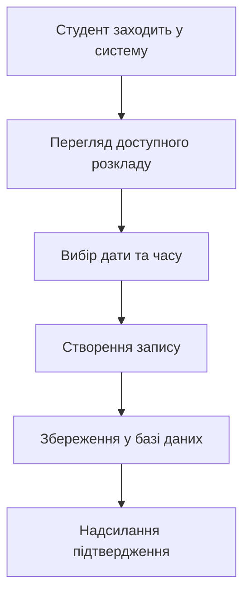

## Розділ 14. Визначення циклів у системі

## 14.1 В інформаційній системі онлайн-запису до психолога в університеті можна виділити такі основні цикли:
## Цикл реєстрації користувача
Студент створює обліковий запис у системі, вводить особисті дані та отримує доступ до функцій запису.

## Цикл запису на консультацію
Користувач обирає психолога, доступну дату та час прийому і формує запис у системі.

## Цикл обробки та підтвердження запису
Система перевіряє доступність часу, зберігає запис у базі даних та надсилає підтвердження користувачу.

## Цикл проведення консультації
Психолог переглядає список записів, проводить консультацію та за потреби вносить службові позначки.

## Цикл оновлення інформації
Користувач може змінити або скасувати запис, після чого система оновлює дані в базі.

## Цикл зворотного зв’язку
Після консультації студент може залишити відгук або система фіксує статистику використання.

Таким чином система працює за циклом:
реєстрація → запис → підтвердження → консультація → оновлення даних → зворотний зв’язок.

## 14.2 Mermaid діаграма процесу запису

