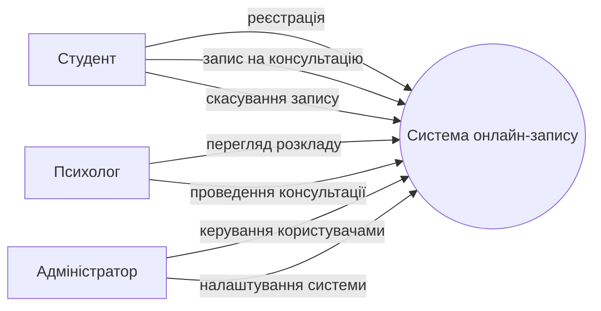

## Розділ 16. Точки впливу на систему

## 16.1 Основними точками впливу на систему онлайн-запису є:
## Користувачі (студенти)
Можуть створювати записи, змінювати або скасовувати консультації.

## Психологи
Керують своїм графіком прийому, підтверджують або коригують записи.

## Адміністратор системи
Налаштовує доступ, додає психологів, змінює розклад та керує базою даних.

## База даних
Зміни у структурі або даних можуть впливати на функціонування всієї системи.

## Налаштування системи та алгоритми роботи
Правила бронювання часу, тривалість консультацій, політика скасування запису.

## Зовнішні сервіси
Наприклад, електронна пошта або система сповіщень для підтвердження записів.

## 16.2 взаємодія користувачів із системою

