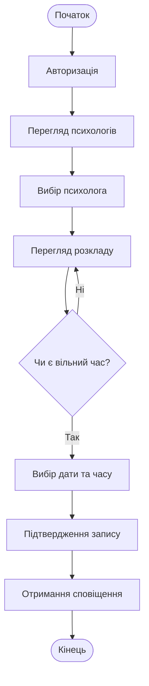
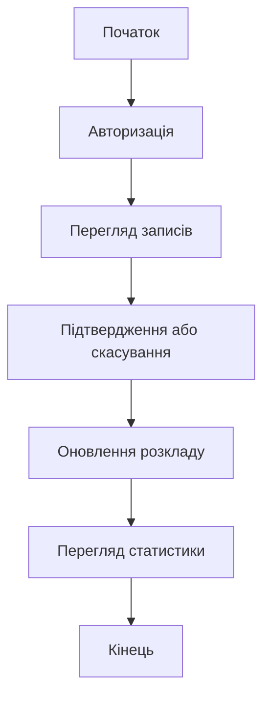
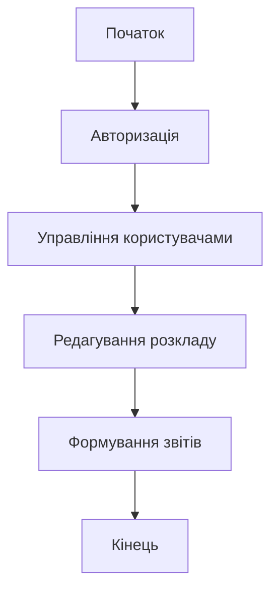

## User Stories у UML-нотації

## Студент

```mermaid
flowchart TD
    Start([Початок]) --> A[Авторизація]
    A --> B[Перегляд психологів]
    B --> C[Вибір психолога]
    C --> D[Перегляд розкладу]
    D --> E{Чи є вільний час?}
    E -- Так --> F[Вибір дати та часу]
    F --> G[Підтвердження запису]
    G --> H[Отримання сповіщення]
    H --> End([Кінець])

    E -- Ні --> D
```

## Психолог

```mermaid
flowchart TD
    A[Початок] --> B[Авторизація]
    B --> C[Перегляд записів]
    C --> D[Підтвердження або скасування]
    D --> E[Оновлення розкладу]
    E --> F[Перегляд статистики]
    F --> G[Кінець]
```

## Адміністратор

```mermaid
flowchart TD
    A[Початок] --> B[Авторизація]
    B --> C[Управління користувачами]
    C --> D[Редагування розкладу]
    D --> E[Формування звітів]
    E --> F[Кінець]
```