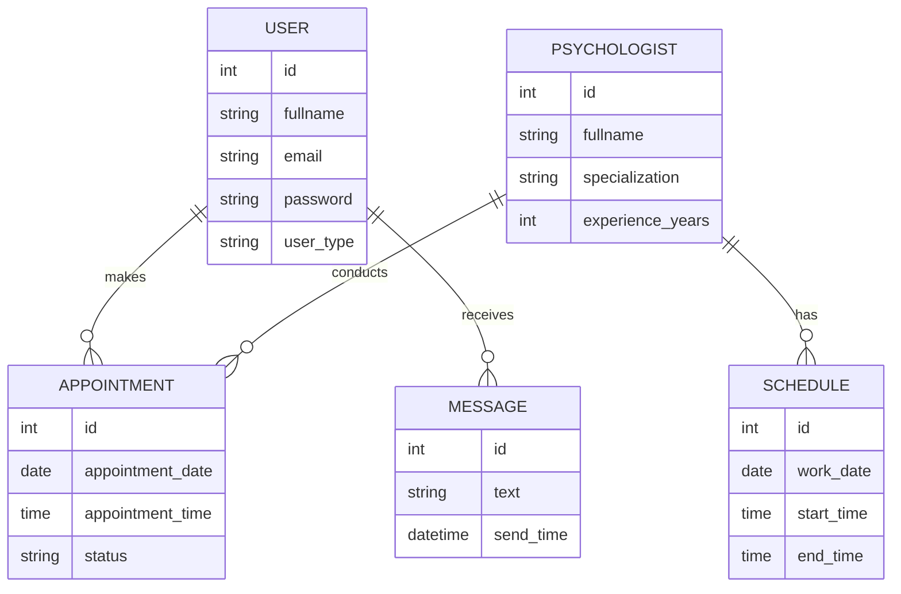

## Розділ 7. Модель даних

## 7.1 Загальна характеристика моделі даних
Модель даних описує структуру збереження інформації в системі. Для інформаційної системи онлайн-запису до психолога доцільно використовувати реляційну модель бази даних.

Основними сутностями системи є:
- Користувач;
- Психолог;
- Запис на консультацію;
- Розклад;
- Повідомлення.

## 7.2 Опис сутностей
## Користувач
Атрибути:
- ID користувача;
- ПІБ;
- Email;
- Пароль;
- Тип користувача.

## Психолог
Атрибути:
- ID психолога;
- ПІБ;
- Спеціалізація;
- Досвід роботи.

## Запис на консультацію
Атрибути:
- ID запису;
- ID користувача;
- ID психолога;
- Дата;
- Час;
- Статус запису.

## Розклад
Атрибути:
- ID розкладу;
- ID психолога;
- Дата;
- Вільний час.

## Повідомлення
Атрибути:
- ID повідомлення;
- ID користувача;
- Текст повідомлення;
- Дата відправлення.

## 7.3 Зв’язки між сутностями
- Один користувач може мати багато записів.
- Один психолог може мати багато консультацій.
- Один розклад належить одному психологу.
- Одне повідомлення належить одному користувачу.

## 7.4 Висновок
Модель даних дозволяє ефективно зберігати та обробляти інформацію про користувачів, психологів та записи на консультації. Використання реляційної бази даних забезпечує швидкий доступ до інформації та підтримує цілісність даних.

## 7.5 ER-діаграма
