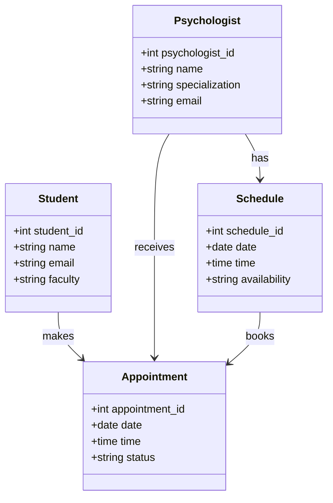

## Розділ 9. Аналіз можливостей масштабування системи

## 9.1 Масштабування системи
Масштабування системи можна розглядати у двох площинах:

## Горизонтальне масштабування
- Додавання нових серверів бази даних (шардінг, реплікація).
- Використання балансувальників навантаження для веб-сервера.
- Можливість розподілу системи на модулі (автентифікація, розклад, аналітика).

## Вертикальне масштабування
- Збільшення ресурсів одного сервера (CPU, RAM, SSD).
- Оптимізація запитів до бази даних.
- Використання кешування (Redis, Memcached) для швидкого доступу до часто використовуваних даних.

## 9.2 Практичні сценарії масштабування
- Якщо кількість студентів зросте (наприклад, кілька тисяч користувачів одночасно), система може бути розгорнута у хмарі (AWS, Azure, Google Cloud).
- Реплікація бази даних для розподілу навантаження між серверами читання та запису.
- Використання мікросервісної архітектури: окремий сервіс для управління записами, окремий для аналітики, окремий для автентифікації.

## 9.3 Технічні аспекти
## Технічні аспекти масштабування:
- Кешування: використання Redis/Memcached для зберігання даних про розклад і доступні слоти, що зменшує навантаження на основну БД.
- API-шлюзи: можливість винести логіку запису та автентифікації в окремі сервіси, що спрощує масштабування.
- Хмарні рішення: використання контейнеризації (Docker, Kubernetes) для автоматичного масштабування залежно від навантаження.
- Реплікація БД: розділення на master/slave вузли — master для записів, slave для читання, що підвищує продуктивність.

## 9.4 Організаційні аспекти 
## Організаційні аспекти:
- Мультикампусна підтримка: система може бути розширена для кількох факультетів або навіть університетів, зберігаючи єдину архітектуру.
- Інтеграція з календарями: можливість синхронізації з Google Calendar або Outlook для зручності студентів і психологів.
- Аналітичні модулі: додавання BI-інструментів для аналізу ефективності роботи психологів та потреб студентів.

## 9.5 UML Class Diagram

